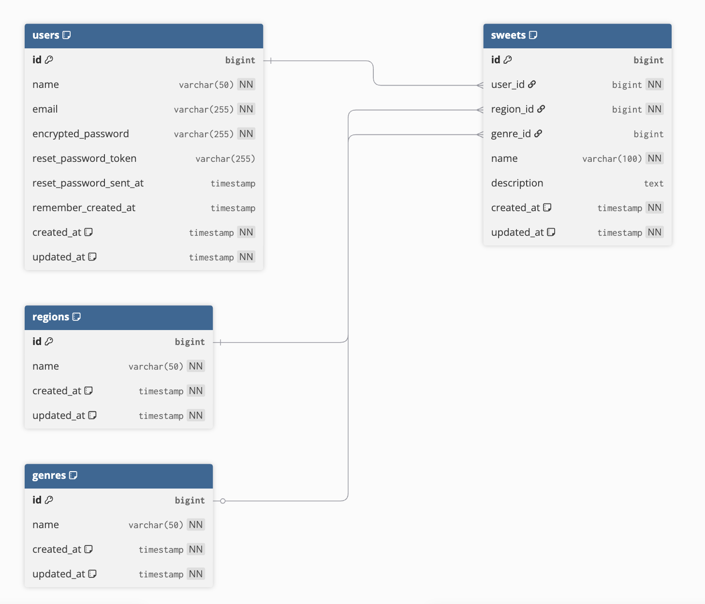

# specialty-sweets-journal
銘菓旅手帖 - 地域の特産お菓子を記録・共有するWebアプリケーション

## サービス概要
旅行先で出会った地域の銘菓を記録・共有するWebアプリケーションです。
ユーザーは各地の銘菓を写真付きで投稿し、味の感想や購入場所を共有できます。
旅行前の「おいしいもの」リサーチや、地元の隠れた名品発見に役立つプラットフォームです。

## このサービスへの思い・作りたい理由
旅行とお菓子が大好きで、旅先で美味しい銘菓に出会ったとき、
この美味しさを誰かと分かち合えたら嬉しいと感じたことから企画しました。
自分が感動した銘菓を紹介し、また、同じように銘菓を愛する方々からのおすすめも知りたい
という気持ちが出発点です。
このサービスを作ることで、旅行者同士が気軽に銘菓の魅力を共有でき、
それぞれの旅がより楽しくなるだけではなく、地域の素晴らしい銘菓との出会いにもつながると考え、
開発したいと思いました。

## ユーザー層について
| ターゲット分類 | ユーザー像 | 理由 |
|---|---|---|
| **メイン** | 地域の銘菓やお土産に興味がある人 | 銘菓は旅行や贈り物の際に重要な要素で、需要が安定している |
| **サブ1** | 自分の地元の銘菓を広めたい人 | 地域への思いがあり、積極的に投稿してくれるコアユーザーになりやすい |
| **サブ2** | SNSよりも落ち着いた掲示板形式で情報を得たい人 | 詳細な感想や情報を求める層で、質の高いコンテンツを期待できる |
| **サブ3** | 旅行前に「おいしいもの」を探したい人 | 事前リサーチをする層で、サービスの価値を実感しやすい |

## サービスの利用イメージ
投稿者側：
- 地元や旅行先で出会った銘菓を写真付きで投稿
- 自分の地域の隠れた名品を全国に紹介
- 投稿した銘菓にコメントがつくことで達成感を得られる

閲覧者側：
- 旅行前に訪問予定地域の銘菓情報を事前チェック
- 他ユーザーの感想を参考に購入を検討
- 新しい銘菓との出会いで旅行や贈り物の楽しみが増加

## ユーザーの獲得について
- 地域の銘菓愛好家
- 旅行好きユーザー
- 旅行系ブログやSNSでの情報発信
- 旅行関連のコミュニティでのサービス紹介
- 口コミ重視層

初期ユーザー獲得：拡散戦略：
- 友人・知人への直接的な紹介からスタート
- 質の高い投稿コンテンツによる口コミでの自然な拡散

## サービスの差別化ポイント・推しポイント

#### **専門性 - 銘菓に特化することで深い情報を提供**
- **差別化内容**：一般的なグルメサイトとは異なり、銘菓のみに特化した専門サービス
- **優れている点**：
  - 銘菓の歴史や製法、地域との関わりまで含めた深い情報共有
  - ノイズの少ない専門的なコミュニティによる質の高い投稿
  - 銘菓愛好家同士の専門的な知識交換が可能

#### **落ち着いた環境 - SNSのような拡散重視ではなく、質の高い情報交換を重視**
- **差別化内容**：バズやいいね数重視ではなく、じっくりと情報を共有する環境
- **優れている点**：
  - 商業的な宣伝に埋もれない純粋な体験談・感想の共有
  - 長期的に価値のある情報が蓄積される仕組み
  - 落ち着いて銘菓について語り合える品質重視のコミュニティ

#### **地域性の重視 - 地域別での情報整理で実用性を向上**
- **差別化内容**：地域を軸とした情報整理により、実際の行動につながりやすい構成
- **優れている点**：
  - 旅行先での銘菓探しが効率的に行える
  - 地域の特色ある銘菓文化の発見と理解促進
  - 贈り物選びの際の実用的な参考情報として活用可能

### サービスの推しポイント

#### **シンプルな操作性 - 掲示板形式でわかりやすい**
- **特徴**：複雑な機能を排除した直感的なUI/UX設計
- **価値**：ITに慣れていない幅広い年齢層でも気軽に参加できる
- **効果**：多様なユーザーによる豊富な情報共有の実現

#### **実用性の高さ - 旅行や贈り物選びに直接役立つ**
- **特徴**：「知る」だけでなく「行動する」ことを前提とした情報構成
- **価値**：実際の購入・体験・贈答に直結する実践的な情報提供
- **効果**：ユーザーの具体的な行動をサポートし、地域経済への貢献も実現

#### **コミュニティ感 - 銘菓を通じた地域間交流の促進**
- **特徴**：食文化を通じた温かいコミュニティの形成
- **価値**：地域を超えた新しいつながりと相互理解の創出
- **効果**：銘菓という共通の興味を通じた継続的な交流関係の構築

## 機能候補
## MVP（Phase 1）- Must
- ユーザー認証（Devise）
- 銘菓投稿機能（名前・地域・ジャンル・説明・画像）
- 銘菓一覧表示機能
- 銘菓詳細表示機能
- 銘菓編集・削除機能

## Phase 2 - Should（優先度高）
- コメント投稿機能
- 基本的な検索機能（地域・名前）
- マイページ機能（自分の投稿一覧）
- お気に入り機能

## Phase 3 - Could（拡張機能）
- 詳細検索機能（ジャンル別）
- ページネーション（Kaminari）
- 評価システム
- 通知機能

## 使用する技術スタック
| カテゴリ | 技術・サービス | バージョン | 用途 | 必要度・導入時期 |
|----------|----------------|-----------|------|------------------|
| バックエンド | Ruby | 3.2.6 | プログラミング言語 | 必須 |
| | Ruby on Rails | 7.2.3 | Webアプリケーションフレームワーク | 必須 |
| | SQLite3 | 1.4 | データベース（開発・テスト） | 必須 |
| | PostgreSQL | 15 | データベース（本番のみ） | デプロイ時 |
| フロントエンド | Tailwind CSS | 3 | ユーティリティファーストCSSフレームワーク | 必須 |
|  | Bootstrap | 5 | グリッドシステム・レスポンシブ対応 | 必須 |
| | JavaScript | ES6+ | フロントエンド動的処理 | 必須 |
|  | Stimulus |  | Rails標準JavaScriptフレームワーク | 必須 |
| Phase 1: 必須機能 | Devise | 最新 | ユーザー認証 | 必須 |
| | Image Processing | ~> 1.2 | 画像処理 | 必須 |
| Phase 2: 機能拡張・デプロイ | pg | ~> 1.1 | PostgreSQL接続 | デプロイ時 |
| | Kaminari | 最新 | ページネーション | 機能拡張時 |
| 開発・テスト環境 | Docker / Docker Compose | - | 開発環境構築 | 必須 |
| | RSpec Rails | - | テストフレームワーク | 必須 |
| | Factory Bot Rails | - | テストデータ生成 | 必須 |
| | Pry Byebug | - | デバッグ | 必須 |
| インフラ・デプロイ | Render | - | Webアプリケーションホスティング | デプロイ時 |
| | Render PostgreSQL | - | 本番データベース | デプロイ時 |
| | Render Disk | - | 画像ファイル保存 | デプロイ時 |
| | GitHub | - | ソースコード管理・自動デプロイ | 必須 |

## ER図

## 画面遷移図
https://www.figma.com/design/g8QaF3UYP8Df5qCHuoEFjK/specialty-sweets-journal?node-id=0-1&t=8CiWs7lvwCL2baU1-1

